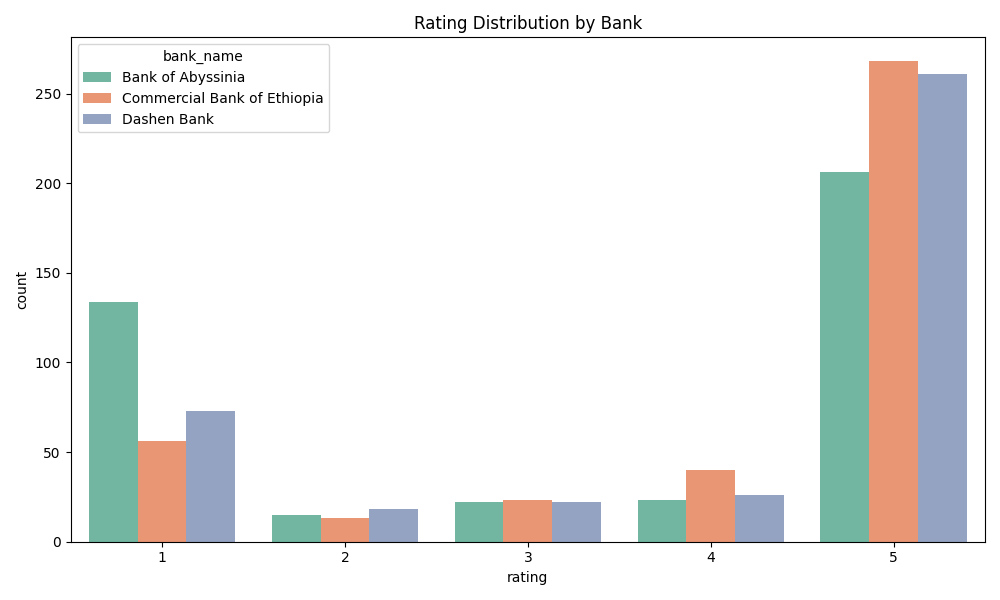
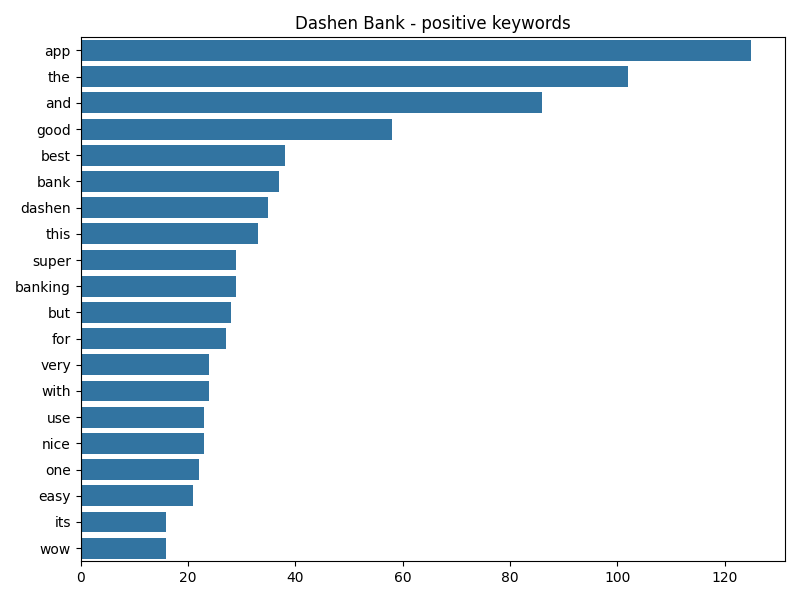

# Customer Experience Analytics — Quick Summary

This repo converts Google Play reviews for three Ethiopian bank apps into actionable insights (sentiment, themes, drivers/pain points).

Quick commands
- Install deps: `pip install -r requirements.txt`
- Generate insights, figures and report (in `.venv`):

```powershell
. .\.venv\Scripts\Activate.ps1
python .\scripts\generate_insights.py
```

Where results go
- Processed data: `outputs/models/reviews_with_sentiment_and_themes.csv`
- Figures: `outputs/figures/` (e.g. `sentiment_trends.png`, `rating_distribution.png`, `wordcloud_*`)
- Report: `outputs/reports/final_insights.md`
- Notebook with embedded visuals: `notebooks/04_insights_and_recommendations.ipynb`

Notes
- AHT (Average Handling Time) is not present in the dataset (reported as a missing KPI).
- Install `wordcloud` in the venv to produce word clouds instead of fallback charts: `pip install wordcloud`

Sample figures
<p align="center">
  
</p>

<p align="center">
  
</p>

<p align="center">
  
</p>

# Customer Experience Analytics

## Overview
This project analyzes customer experience through reviews from banking apps. It involves data collection, preprocessing, sentiment analysis, and machine learning to understand customer satisfaction patterns.

## Project Structure
The project follows a clean, modular architecture:

```
src/customer_analytics/
├── __init__.py
├── config/                 # Configuration
│   ├── __init__.py
│   └── settings.py         # Centralized settings
├── visualisation/          # Plotting and graphs
│   ├── __init__.py
│   └── plotter.py          # Visualization utilities
├── analysis/               # Analysis logic
│   ├── __init__.py
│   └── eda.py              # Exploratory data analysis
├── utils/                  # Helper modules
│   ├── __init__.py
│   ├── scraper.py          # Data collection (Google Play Store)
│   ├── preprocessor.py     # Data cleaning and preprocessing
│   ├── data_loader.py      # Database interactions
│   ├── data_cleaning.py    # General cleaning utilities
│   └── alignment.py        # Data alignment functions
└── pipeline/               # NLP pipeline (planned)
    ├── __init__.py
    ├── train.py            # Model training (planned)
    ├── predict.py          # Predictions (planned)
    └── evaluate.py         # Evaluation (planned)
```

## Setup

### Prerequisites
- Python 3.8+
- PostgreSQL (optional, for data storage)

### Installation
1. Clone the repository
2. Install dependencies:
   ```bash
   poetry install
   # or
   pip install -r requirements.txt
   ```

### Configuration
Create a `.env` file with (example values):
```
CBE_APP_ID=com.combanketh.mobilebanking
BOA_APP_ID=com.bankofabyssinia.app
DASHEN_APP_ID=com.dashenbank.mobile
REVIEWS_PER_BANK=400
MAX_RETRIES=3
```

## Usage

### Task 1: Data Collection and Analysis

#### 1. Scrape Reviews
```python
from customer_analytics.utils import PlayStoreScraper

scraper = PlayStoreScraper()
df = scraper.scrape_all_banks()
```

#### 2. Preprocess Data
```python
from customer_analytics.utils import ReviewPreprocessor

preprocessor = ReviewPreprocessor()
preprocessor.process()
```

#### 3. Exploratory Data Analysis
```python
from customer_analytics.analysis import EDA

eda = EDA()
eda.load_data('data/processed/reviews_processed.csv')
print(eda.summary_report())
```

#### 4. Visualize Data
```python
from customer_analytics.visualisation import Plotter

plotter = Plotter()
plotter.plot_histogram(df, 'rating', title='Rating Distribution')
```

### Database Operations
```python
from customer_analytics.utils import DatabaseLoader

loader = DatabaseLoader()
if loader.connect():
    loader.create_tables()
    # loader.insert_data(restaurants_df, reviews_df)
    loader.close()
```

### Task 3: PostgreSQL Persistent Storage

Use the provided helper and script to store processed reviews into a
PostgreSQL database named `bank_reviews`.

- **Schema**: see `sql/schema.sql` for `banks` and `reviews` table definitions.
- **Helper**: `src/customer_analytics/utils/db_helper.py` exposes `PostgresDB`.
- **Script**: `scripts/store_reviews_to_postgres.py` loads
    `data/processed/reviews_processed.csv` (path from settings) and inserts
    rows into Postgres. Database credentials are read from environment
    variables: `PGHOST`, `PGPORT`, `PGDATABASE`, `PGUSER`, `PGPASSWORD`.

Example (PowerShell):
```powershell
# set environment vars (temporary for session)
$env:PGHOST = 'localhost'; $env:PGPORT = '5432'; $env:PGDATABASE = 'bank_reviews';
$env:PGUSER = 'postgres'; $env:PGPASSWORD = 'password'

python .\scripts\store_reviews_to_postgres.py --min-rows 400
```

The script will create tables if they do not exist, insert reviews in
batched transactions, and print counts per bank. See `sql/schema.sql`
for the schema and `src/customer_analytics/utils/db_helper.py` for the
implementation details.

Docker (optional, reproducible Postgres)
--------------------------------------

Start a local Postgres configured for this project (listens on host port 5443):

```powershell
docker compose up -d
# wait for healthcheck or check logs:
docker compose ps
```

The compose file creates a database `customer_fintec` with user `postgres` and password `root`.

Dumping the database
--------------------

If you want a SQL dump, use `pg_dump` or the included helper script:

```powershell
# If pg_dump is available:
pg_dump --dbname "%DATABASE_URL%" -f customer_fintec_dump.sql

# Or use the project's helper (will prefer pg_dump, fallback to psycopg2 export):
python .\scripts\dump_db.py
```

## Development

### Code Standards
- Follow PEP8 conventions
- Use type hints where applicable
- Write docstrings for all classes and functions
- Keep modules focused and single-purpose

### Testing
```bash
pytest tests/
```

## Task 2: Sentiment & Thematic Analysis

Run the end-to-end Task 2 pipeline (example runner provided):

```powershell
# from repo root (Windows PowerShell)
python .\scripts\customer_feedback_pipeline.py --data data/processed/reviews_processed.csv --out outputs/models --method vader
```

- `--method` supports `vader` (default), `textblob`, or `transformer` (requires `transformers` installed).
- Outputs are written to `outputs/models/`:
    - `reviews_with_sentiment_and_themes.csv` — per-review sentiment and assigned theme
    - `themes_by_bank.json` — extracted topics per bank
    - `task2_metrics.json` — basic coverage metrics

Notes:
- If `data/processed/reviews_processed.csv` is not present, the script will generate a sample dataset for demonstration.
- For best-quality sentiment, install `transformers` and use `--method transformer`. Transformer inference can be slower and may require internet to download model weights on first run.


## Contributing
Please follow the coding standards and submit pull requests for review.

## Documentation

Short, focused docs were added under the `docs/` folder to help you run the project and notebooks:

- `docs/README.md` — Quick start and where outputs are written; CLI and test examples.
- `docs/dependencies.md` — Dependency installation instructions and NLTK setup (VADER), plus optional packages (transformers, scikit-learn).
- `docs/notebooks.md` — Notebook execution order and notes: run Task 1 first (preprocessing), then Task 2. Explains that Task 2 notebook uses the package pipeline helper and writes outputs to `outputs/models` in the project root.

See the `docs/` folder for step-by-step instructions and troubleshooting tips.

## Task 4: Insights & Recommendations — Completed

The insights stage (Task 4) has been executed. Results, visualizations, and a short report were generated from the processed reviews dataset.

- **Report**: `outputs/reports/final_insights.md` (contains KPI checks, bank-level drivers & pain points, recommendations, and ethics/bias notes).
- **Notebook**: `notebooks/04_insights_and_recommendations.ipynb` — now contains the final insights section and a code cell that displays all charts from `outputs/figures/`.
- **Figures**: Charts saved in `outputs/figures/` (examples: `sentiment_trends.png`, `rating_distribution.png`, `wordcloud_*.png`).

Key outcomes:

- **Total reviews analysed**: 1,200 (approx — see `final_insights.md` for exact counts).
- **Banks covered**: Bank of Abyssinia, Commercial Bank of Ethiopia, Dashen Bank.
- **Sentiment & themes**: Sentiment scores and thematic labels are present in `outputs/models/reviews_with_sentiment_and_themes.csv`.
- **AHT (Average Handling Time)**: MISSING in dataset — listed as an unmet KPI in the report.

How to reproduce visuals and report (PowerShell):

```powershell
# Activate the project's virtual environment
. .\.venv\Scripts\Activate.ps1

# Re-generate insights, figures and markdown
python .\scripts\generate_insights.py

# Open the notebook and run the last cell to display generated figures
code .\notebooks\04_insights_and_recommendations.ipynb
```

Notes and next steps:

- To generate word-cloud images instead of fallback bar charts install the `wordcloud` package into the virtual environment before running the script:

```powershell
pip install wordcloud
```

- The notebook and markdown include ethics/bias notes — review them before sharing results with stakeholders.
- If you want, I can open a PR on branch `task-4` with these artifacts committed and a short summary for reviewers.

## Sample Figures

Below are a few representative charts generated by the analysis pipeline. Open the notebook `notebooks/04_insights_and_recommendations.ipynb` to see all figures and the full report.

<p align="center">
    
</p>

<p align="center">
    
</p>

<p align="center">
    
</p>
